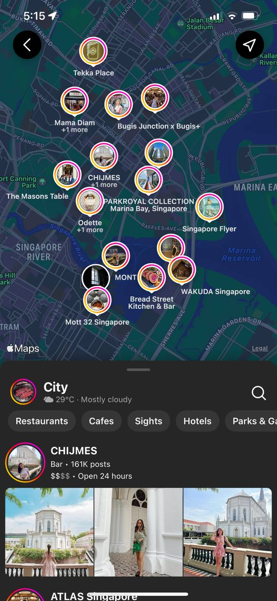

import ReactPlayer from 'react-player';

## Requirements

1. Create a bottom panel that have snapping points
2. This panel should be able to scroll like Instagram explore page (the one with map and circular pins)
3. No native libraries allowed

## Instagram Location Explore page behavior break down



<!--truncate-->

This is how the current (July 2022) Instagram explore by location page looks like. You can see that they have a bottom panel at the bottom of the screen with the drag bar just below the top of the panel.

Upon playing/experimenting with the panel here are some of the behavior break down

1. There are snapping points at 40% and 100%, where the panels will always go back to those same location if you try to pull higher or lower. They will select whichever is the closest.
2. You cannot scroll the list and the panel at the same time. When you first enter the page and attempt to scroll the list, you are actually scrolling the panel. Within the same gesture, you can only bring the panel to the 100% snapping point. Only upon letting your finger go and initiating the 2nd gesture, then you can scroll the list.

Here is a video of how the bottom panel interacts:

<ReactPlayer playing controls url="/ig-location-explore-interaction.mp4" />

## Research

With the rise of Reanimated 2.0, there comes a huge waves of react native bottom panels that are using Reanimated and react-native-gesture-handler. There is a library that always comes up during my google search which is [react-native-bottom-sheet](https://github.com/gorhom/react-native-bottom-sheet).

However this does not fit the requirement above where no native libraries are allowed because Reanimated 2.0 requires native library to be added.

After further digging, this library that I found on GitHub seems to match my use case and requirement [rn-sliding-up-panel](https://github.com/octopitus/rn-sliding-up-panel).

## Working solution in React Native only

I have managed to got it working somewhat like Instagram, but there are some quirks.

Here is the snack link (if you are lazy to read): [https://snack.expo.dev/@kohchihao/instagram-style-swiping-with-bottom-panel](https://snack.expo.dev/@kohchihao/instagram-style-swiping-with-bottom-panel)

Let me explain my code:

I will skip through some parts that are easy to understand and not relevant to building this feature.

```typescript
// The starting point of the panel
const [animatedValue] = useState(new Animated.Value(SNAPPING_POINTS.MIDDLE));

// Is the panel at the highest snapping point
const [isAtTop, setIsAtTop] = useState(false);

// The list y-axis offset
const yOffset = useRef(0);

// Can the list scroll or not?
const [canScroll, setCanScroll] = useState(false);
```

For this specific `useEffect` , if you realize inside the video I recorded, there some behaviors specifically

1. If the panel is at the top, the user can scroll the list
2. If the panel is NOT at the top, the user can ONLY swipe the panel

This snippet partially resolves the #2 breakdown behavior.

```typescript
useEffect(() => {
  if (isAtTop) {
    setCanScroll(true);
  } else {
    setCanScroll(false);
  }
}, [isAtTop]);
```

To fully satisfy the #2 breakdown behavior, we also need to keep track the y-axis of the list. Basically we need to know is the list at the top or not, so that we can disable scroll.

```typescript
const onScroll = (event) => {
  const didScrollBackToTop =
    yOffset.current > 0 && event.nativeEvent.contentOffset.y <= 0;
  if (didScrollBackToTop) {
    // Since scroll is at the top, we want to disable scrolling so that on the 2nd touch,
    // the user drags the "panel" (the View with draghandler)
    setCanScroll(false);
  }
  yOffset.current = event.nativeEvent.contentOffset.y;
};

const onDragEnd = (event) => {
  const didDragEndAtTop =
    yOffset.current <= 0 && event.nativeEvent.contentOffset.y <= 0;
  if (didDragEndAtTop) {
    // Since drag ended at the top, we want to disable scrolling so that on the 2nd touch,
    // the user drags the "panel" (the View with draghandler)
    setCanScroll(false);
  }
  yOffset.current = event.nativeEvent.contentOffset.y;
};
```

To know where the user have scrolled to, we can use 2 events provided by `ScrollView` and `FlatList` namely `onScroll()` and `onScrollEndDrag` .

Inside `onScroll` , we have the event that provides us with the `contentOffset` . Given that we initially set the `yOffset` to be `0` , we want to check if did the user scroll back to the top, if yes, we want to disable scroll and let the user swipe the panel in the 2nd gesture instead. The same goes for `onDragEnd` .

Finally, about the view. From `SlidingUpPanel` , we have access to this object called `dragHandler` which provides all the gesture handler settled for us.

```typescript
<View style={styles.container}>
  <SlidingUpPanel
    draggableRange={draggableRange}
    snappingPoints={snappingPoints}
    showBackdrop={false}
    animatedValue={animatedValue}
    allowDragging={true}
    containerStyle={{
      backgroundColor: 'transparent',
      bottomPadding: 100,
    }}
    onBottomReached={onSlidingPanelBottomReached}
    onBackButtonPress={() => false}
  >
    {(dragHandler) => {
      const newDragHandler = canScroll ? null : dragHandler;
      return (
        <View {...newDragHandler}>
          <ScrollView
            style={{ backgroundColor: 'pink', bottomPadding: 500 }}
            scrollEnabled={canScroll}
            bounces={false}
            onScroll={onFlatListScroll}
            onScrollEndDrag={onFlatListDragEnd}
          >
            {[...Array(100)].map((_, index) => {
              return <Text>Hello {index}</Text>;
            })}
          </ScrollView>
        </View>
      );
    }}
  </SlidingUpPanel>
</View>
```

To trick the user, we can use our state `canScroll` to determine if we should pass the `dragHandler` to the View or not. At the same time we can pass `canScroll` to `scrollEnabled` for the `ScrollView` to properly disable scrolling.

Here is the link to the snack, please feel free to try it [https://snack.expo.dev/@kohchihao/instagram-style-swiping-with-bottom-panel](https://snack.expo.dev/@kohchihao/instagram-style-swiping-with-bottom-panel).
